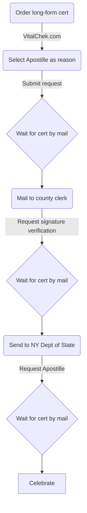

# How to Apostille a New York City Birth Certificate

## Relevant Links
- [Process overview](https://portal.311.nyc.gov/article/?kanumber=KA-01012)
- [VitalChek request form](https://www.vitalchek.com/birth-certificates/new-york/new-york-city-dept-of-health-and-mental-hygiene)
- [County clerk verification info](https://portal.311.nyc.gov/article/?kanumber=KA-01029)
- [NY Dept of State Apostille info](https://dos.ny.gov/apostille-or-certificate-authentication)

## Process Outline

